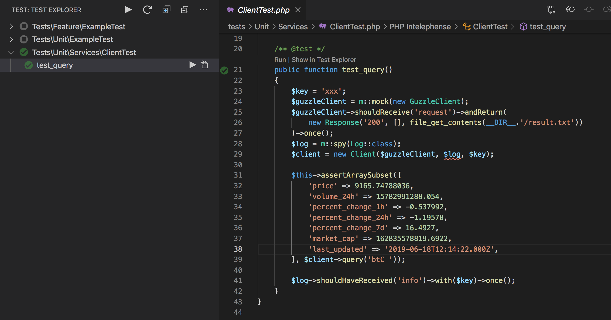

## 說明

活動分享專案：[PHP 也有 Day #46：如何利用 PHPUnit + Mockery 開發 API ？ 2019/06/18](https://community.laravel-dojo.com/phptheday/2019-06-18)



## 起步

1. 安裝環境套件
```bash
    composer install
```
2. 產生 application key
```bash
    composer run post-create-project-cmd
```
3. 產生環境變數檔
```bash
    composer run post-root-package-install
```

4. 到 https://pro.coinmarketcap.com 註冊帳號並申請key

5. 將申請的 key 加入專案環境變數 .env 檔案中的 CMC_API_KEY 變數
```
    CMC_API_KEY=${申請的專案變數}}
```

## 補充

- 利用 CoinMarketCap API: https://pro-api.coinmarketcap.com/v1/cryptocurrency/listings/latest
    - 連結: [文件](https://coinmarketcap.com/api/documentation/v1/#operation/getV1CryptocurrencyListingsLatest)

- vscode使用輔助測試套件：https://github.com/recca0120/vscode-phpunit
